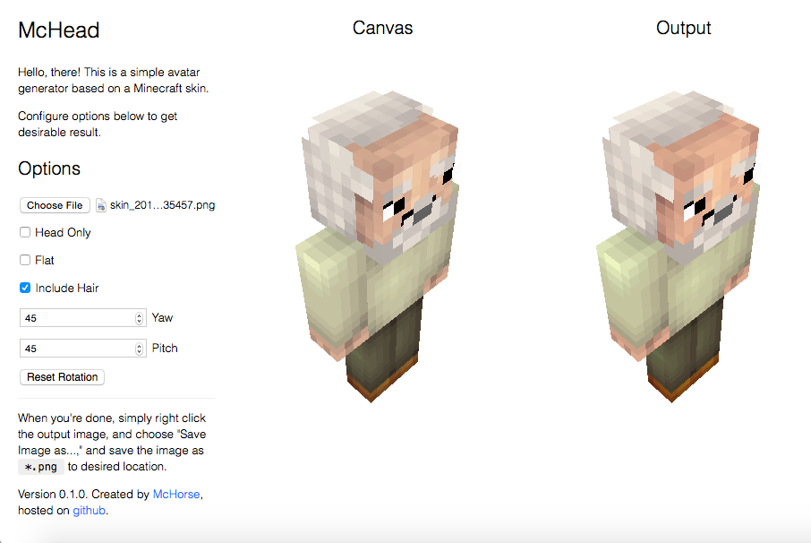
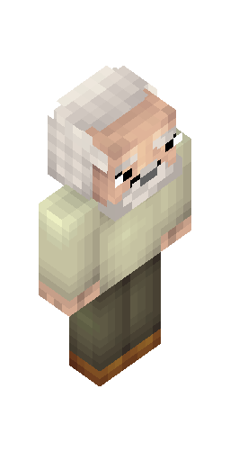
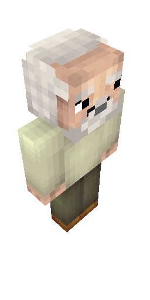
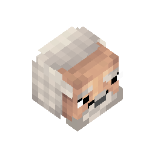
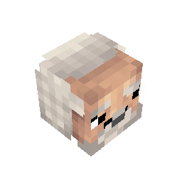

# McHead

[McHead](http://mchorse.github.io/mchead/) is a simple web app that allows you to create avatars 
from a texture of minecraft skin. This web app generates a render from given texture skin.

McHead uses wonderful 3D library [ThreeJS](http://github.com/mrdoob/three.js/).

## Examples

Here's two full body renders created by McHead, one is flat, and one is 3D:

And here's two head renders, one is flat, and one is 3D:

## License

The source code is licensed under MIT:

    The MIT License (MIT)
    
    Copyright (c) 2016 McHorse
    
    Permission is hereby granted, free of charge, to any person obtaining a copy 
    of this software and associated documentation files (the "Software"), to deal 
    in the Software without restriction, including without limitation the rights 
    to use, copy, modify, merge, publish, distribute, sublicense, and/or sell 
    copies of the Software, and to permit persons to whom the Software is furnished 
    to do so, subject to the following conditions:
    
    The above copyright notice and this permission notice shall be included in 
    all copies or substantial portions of the Software.
    
    THE SOFTWARE IS PROVIDED "AS IS", WITHOUT WARRANTY OF ANY KIND, EXPRESS OR 
    IMPLIED, INCLUDING BUT NOT LIMITED TO THE WARRANTIES OF MERCHANTABILITY, 
    FITNESS FOR A PARTICULAR PURPOSE AND NONINFRINGEMENT. IN NO EVENT SHALL 
    THE AUTHORS OR COPYRIGHT HOLDERS BE LIABLE FOR ANY CLAIM, DAMAGES OR OTHER 
    LIABILITY, WHETHER IN AN ACTION OF CONTRACT, TORT OR OTHERWISE, 
    ARISING FROM, OUT OF OR IN CONNECTION WITH THE SOFTWARE OR THE USE OR OTHER 
    DEALINGS IN THE SOFTWARE.
